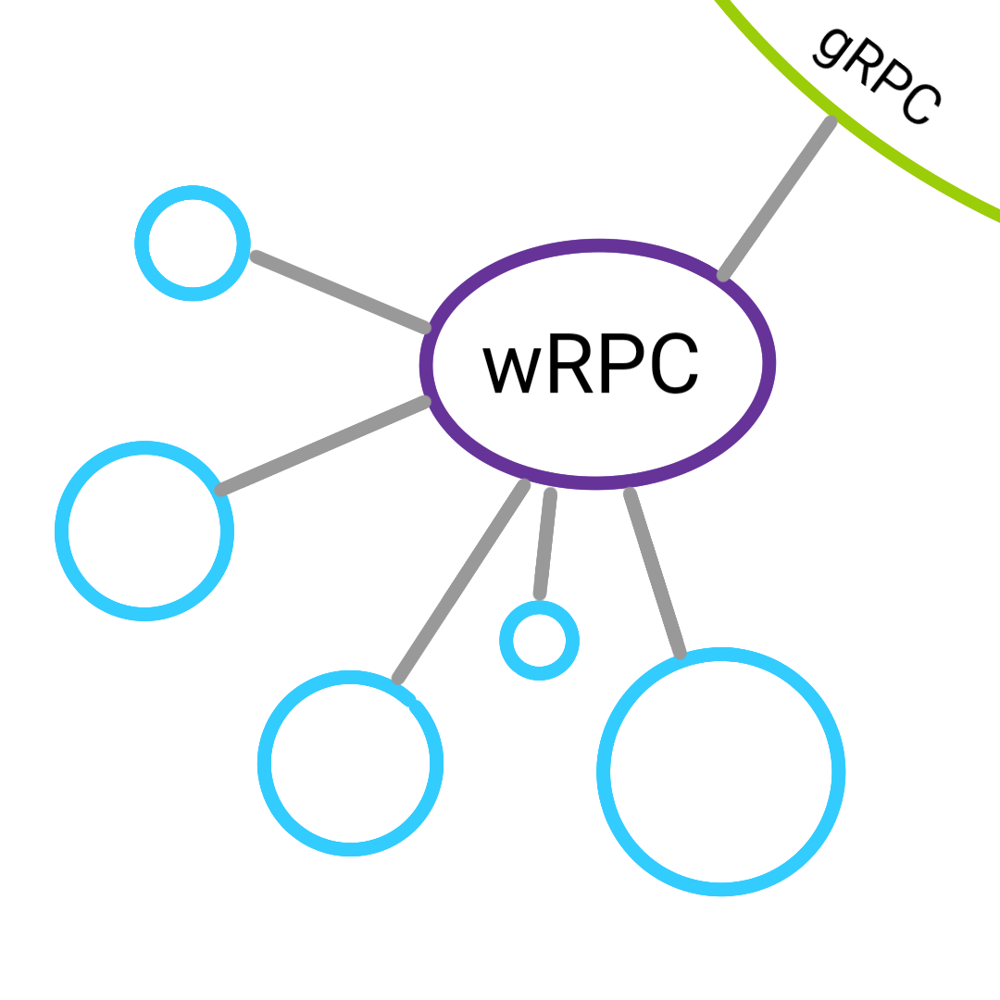

Wasm RPC Protocol Specification
===============================
This is the specification of the Protocol Buffers that wasm/node modules will
use to setup their RPC interfaces with the central RPC server.

RPC Overview
------------

.. figure:: figures/landing-2.svg
    :align: center
    :alt: A picture of a server and node structure

    Borrowed from `gRPC <https://grpc.io/docs/guides/>`_

Overall in the MVP of this RPC Framework only the above server and node
implimentation will be used. Direct node communication will not be supported.

When a node is initialized it will pass a protobuf describing it's functions
and how to call them. Once initialized any other module or direct JS Call can
be made to that module.

    What the overall structure of wRPC looks like

The blue nodes above represent the wasm modules that wRPC will orchestrate.
Eventually wRPC will communicate with more traditional RPC frameworks such as
gRPC.

What still needs to be figured out
~~~~~~~~~~~~~~~~~~~~~~~~~~~~~~~~~~
- Will Data be returned as another proto or as a direct JS value?
- Will the core be written in JS or Wasm?
- What's the best way to make this easy for other Devs to use?
- What are some default failure modes/exceptions?

Proto Descriptions
------------------
Initialization Proto
~~~~~~~~~~~~~~~~~~~~
The information that the initialization proto will provide are as follows

- Module name
- How to initialize
- Any extra steps to call functions
- Functions
    + name
    + params
    + return type
    + failure types?
    + async?
- Public info/Data
- Meta data?

Curent Draft
++++++++++++
.. literalinclude:: examples/init.proto
    :language: proto

Response proto
~~~~~~~~~~~~~~
The idea of this protobuf response is based on `Rust's std::option type <https://doc.rust-lang.org/std/option/>`_.
Depending on the error and if the remote client can raise an exception wRPC may
insert a generic failure.

- Success/Fail
    + if fail why
    + Data

Current Draft
+++++++++++++
.. literalinclude:: examples/result.proto
    :language: proto

Examples
--------
See the `examples folder <https://gitlab.com/warfields/wRPC-Spec/tree/master/examples>`_.

What's next?
------------
See :ref:`js_bindings` for how to interact with JavaScript.
